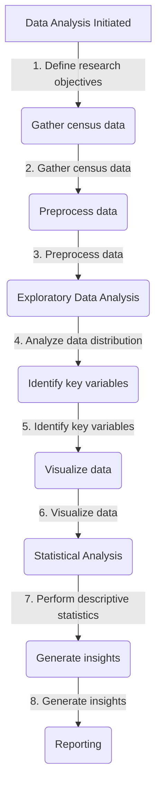

# Data_analysis

## Project Background Information.
Every ten years, the United Kingdom undertakes a census of the population, with the most recent one having been conducted in 2021. 
The purpose of such a census is to compare different people across the nation and to provide the government with accurate statistics of the population to enable better planning, to develop policies, and to allocate certain funding.
Report of a moderately populated town for suggestions on future investments and development approach for the unused plot of land. Suggestions can be made when; the provided census data is initially cleaned. In cases when the data is not clean, cleaning the data includes distinguishing errors in the data and then modifying, upgrading or dropping the data to modify them, which has been done in the first section of the report.
Consequent segments of the report will highlight the critical examination embraced, particularly pointing at support suggestions given, which will incorporate a diagram of the town's population demographic, taken after a detailed examination of the town's anticipated population development, employment patterns, travellers, and inhabitancies rates.
## About the Mock Census.
The mock census data contains randomly generate data using the Faker package in Python. It has been generated in a similar manner to (and designed to directly emulate the format of) the 1881 census of the UK wherein only a few questions were asked of the population. 
The fields recorded are as follows:
* Street Number (this is set to “1” if it is a unique dwelling);
* Street Name;
* First Name of occupant;
* Surname of occupant;
* Age of occupant;
* Relationship to the “Head” of the household (anyone aged over 18 can be a “Head” – they are
simply the person who had the responsibility to fill in the census details);
* Marital status (one of: Single, Married, Divorced, Widowed, or “NA” in the case of minors);
* Gender (one of: Male, Female; note that other responses were not implemented in 1881);
* Occupation (this field was implemented in a modern style, rather than typical 1881
occupations);
* Infirmity (we have implemented a limited set of infirmities following the style of 1881);
* Religion (we have implemented a set of real-world religions).
### Visualizations
The Data Analysis process of the Census Data.

## RECOMMENDATION
With the high population of lodgers coming to the town, university students, PhD students and skilled professionals are leaving the town for the city. Building a train station will help create jobs for the unemployed, reduce congestion, improve productivity, and expand travel choices.
The town population have about 22% Christian, and most of them are between the ages 20 and above; it is likely that the religion will grow in future years. The town will need another religious centre for the Christians, considering their population, and this will help the town increase the number Christians migration.
The aged individuals who are divorced, single, widowed, and retired are about 10% of the town population. The future number of aged individuals will increase given that about 40% of the population is within (30-65) and also considering the low percentage of Infirmity in the town. Thus, investing in old aged care will benefit the town.
Other investment and construction can be considered in the future, such as recreational centres, school, building houses, employment and training given the population of the town increases. The population of old age people will increase in the future given the population of retired and old people in the town so investing in an old aged care should come before other investment.
